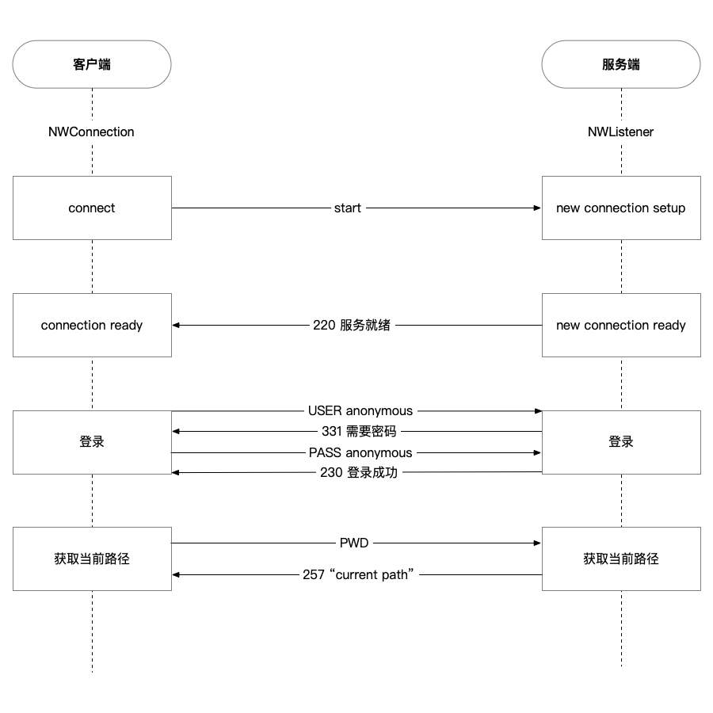
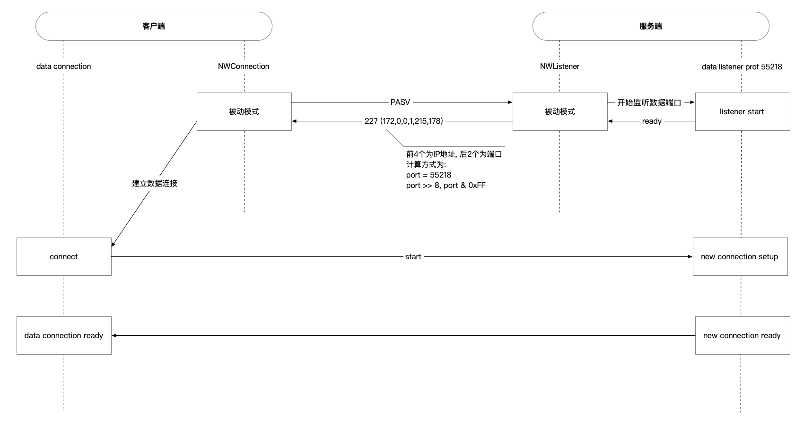
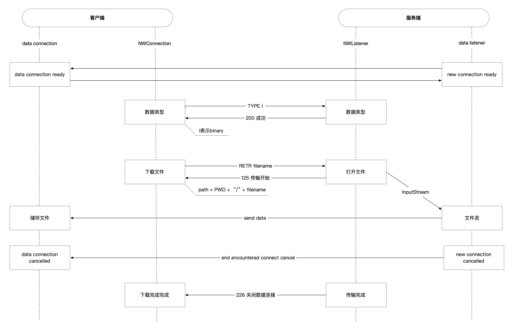

# FTP
A description of this package.

## Requirements
- iOS 12.0+ / macOS 10.14+
- Xcode 12.0+
- Swift 5.3+

## Installation
Swift Packages https://github.com/920201772/FTP.git

## Usage
### Server
```swift
let service = try? FTP.Service()
service?.start()
```

# 实现
FTP运行于TCP协议之上, 所以使用iOS 12.0支持的Network库来实现.


[服务端连接过程示例](#连接过程示例)

主动和被动模式:
FTP有两种使用模式：主动和被动。
主动模式要求客户端和服务器端同时打开并且监听一个端口以创建连接。在这种情况下，客户端由于安装了防火墙会产生一些问题。
所以，创立了被动模式。被动模式只要求服务器端产生一个监听相应端口的进程，这样就可以绕过客户端安装了防火墙的问题。


[服务端被动模式示例](#被动模式示例)


[服务端文件下载示例](#文件下载示例)

## 服务端
### 连接过程示例
使用TCP监听一个控制端口(FTP协议控制端口默认为21)
```swift
let listener = try NWListener(using: .tcp, on: 21)
listener.newConnectionHandler = { 
    // 与客户端建立连接
    connect.stateUpdateHandler = {
        // 监听与客户端连接状态改变
        stateChangeHandler($0)
    }
    connect.start(queue: queue)
}
listener.start(queue: queue)
```

等待与客户端连接成功
```swift
func stateChangeHandler(_ state: NWConnection.State) {
    switch state {
        case .ready:
            // 发送 220 服务就绪, 每条命令或响应的结尾是\r\n
            connect.send(content: "220 \r\n".data(using: .utf8), completion: .contentProcessed({ _ in }))
            // 接收数据
            receive()

        default: break
    }
}
```

接收数据客户端命令
```swift
func receive() {
    connect.receive(minimumIncompleteLength: 1, maximumLength: Int(UInt16.max)) { data, ctx, isFinal, error in
        if let data = data {
            if let text = String(data: data, encoding: .utf8) {
                let params = text.trimmingCharacters(in: .newlines).split(separator: " ", maxSplits: 1)
                switch params.first {
                case "USER":
                    // 需要密码
                    connect.send("331 \r\n")

                case "PASS":
                    // 登录成功
                    connect.send("230 \r\n")
                
                case "PWD":
                    // 当前路径
                    connect.send("257 \"currentPath\"\r\n")
                     
                default: 
                    // 无效命令
                    connect.send("500 \r\n")
                }
            } else {
                connect.send("500 \r\n")
            }
        }

        if isFinal {
            connect.cancel()
        } else {
            receive()
        }
    }
}
```

### 被动模式示例
收到`PASV`(被动模式)命令, 监听数据端口
```swift
// 0为系统选择端口
let dataListener = try NWListener(using: .tcp, on: 0)
dataListener.stateUpdateHandler = {
    switch $0 {
        case .failed(_):
            // 连接关闭
            connect.send("426 \r\n")
        
        case .ready:
            guard let ip = en0IPv4Address?.replacingOccurrences(of: ".", with: ","),
                  let port = dataListener.port?.rawValue else {
                connect.send("426 \r\n")
                return
            }
            
            // 进入被动模式
            connect.send("227 (\(ip),\(port >> 8),\(port & 0xFF))\r\n")
            
    default:
        break
    }
}
dataListener.newConnectionHandler = { dataConnect in
    dataConnect.start(queue: queue)
}

dataListener.start(queue: queue)
```

### 文件下载示例
以下步骤前置条件需要被动模式开启
收到`RETR filename`(从服务器上复文件)命令
```swift
// 使用文件流可以避免文件过大问题
let path = "\(currentPath)/\(filename)"
guard let stream = InputStream(fileAtPath: path) else {
    // 文件不可用
    connect.send("550 \r\n")
    return
}
stream.delegate = self
stream.schedule(in: .main, forMode: .common)
stream.open()

// 数据连接已打开, 传输开始
connect.send("125 \r\n")

// StreamDelegate
func stream(_ aStream: Stream, handle eventCode: Stream.Event) {
    switch eventCode {
        case .hasBytesAvailable:
            let stream = aStream as! InputStream
            let mpData = UnsafeMutablePointer<UInt8>.allocate(capacity: Int(UInt16.max))
            let length = stream.read(mpData, maxLength: Int(UInt16.max))
            if length != 0 {
                // 传输数据
                dataConnect.send(Data(bytes: mpData, count: length))
            }
            mpData.deallocate()
                
        case .errorOccurred, .endEncountered:
            aStream.close()
            aStream.remove(from: .main, forMode: .common)
            dataConnect.cancel()

            // 传输完成, 结束数据连接
            connect.send("226 \r\n")

        default:
            break
    }
}
```

# FTP 协议参考
[RFC959 FTP 中文文档](Resources/RFC959%20FTP%20传输协议.pdf)

## FTP 响应码
| 响应代码 | 状态 |
| --- | --- |
| 1yz | 未处理 |
| 2yz | 完成处理 |
| 3yz | 正在处理 |
| 4yz | 暂时错误 |
| 5yz | 永久错误 |

| 响应代码 | 类型 |
| --- | --- |
| x0z | 语法错误 |
| x1z | 信息 |
| x2z | 连接 |
| x3z | 认证 |
| x4z | 未定义 |
| x5z | 文件 |

| 响应代码 | 解释说明 |
| --- | --- |
| 110 | 新文件指示器上的重启标记 |
| 120 | 服务器准备就绪的时间 (分钟数) |
| 125 | 数据连接已打开, 传输开始 |
| 150 | 文件状态OK, 将打开数据连接 |
| 200 | 成功 |
| 202 | 命令没有执行 |
| 211 | 服务状态回复 |
| 212 | 目录状态回复 |
| 213 | 文件状态回复 |
| 214 | 帮助信息回复 |
| 215 | 系统类型回复 |
| 220 | 服务就绪 |
| 221 | 退出网络 |
| 225 | 打开数据连接 |
| 226 | 结束数据连接 |
| 227 | 进入被动模式 (IP地址, ID端口) |
| 230 | 登录因特网 |
| 250 | 文件行为完成 |
| 257 | 路径建立 |
| 331 | 要求密码 |
| 332 | 要求帐号 |
| 350 | 文件行为暂停 |
| 421 | 服务关闭 |
| 425 | 无法打开数据连接 |
| 426 | 结束连接 |
| 450 | 文件不可用 |
| 451 | 遇到本地错误 |
| 452 | 磁盘空间不足 |
| 500 | 无效命令 |
| 501 | 错误参数 |
| 502 | 命令没有执行 |
| 503 | 错误指令序列 |
| 504 | 无效命令参数 |
| 530 | 未登录网络 |
| 532 | 存储文件需要帐号 |
| 550 | 文件不可用 |
| 551 | 不知道的页类型 |
| 552 | 超过存储分配 |
| 553 | 文件名不允许 |

## FTP 命令
| 命令 | 描述 |
| --- | --- |
|ABOR | 中断数据连接程序 |
|ACCT *`account`* | 系统特权帐号 |
|ALLO *`bytes`* | 为服务器上的文件存储器分配字节 |
|APPE *`filename`* | 添加文件到服务器同名文件 |
|CDUP *`dir path`* | 改变服务器上的父目录 |
|CWD *`dir path`*	| 改变服务器上的工作目录 |
|DELE *`filename`* | 删除服务器上的指定文件 |
|HELP *`command`* | 返回指定命令信息 |
|LIST *`name`* | 如果是文件名列出文件信息, 如果是目录则列出文件列表 |
|MODE *`mode`* | 传输模式 (S=流模式, B=块模式, C=压缩模式) |
|MKD *`directory`* | 在服务器上建立指定目录 |
|NLST *`directory`* | 列出指定目录内容 |
|NOOP | 无动作, 除了来自服务器上的承认 |
|PASS *`password`* | 系统登录密码 |
|PASV | 被动模式, 请求服务器等待数据连接 |
|PORT *`address`* | 主动模式, IP地址和两字节的端口ID |
|PWD | 显示当前工作目录 |
|QUIT | 从 FTP 服务器上退出登录 |
|REIN | 重新初始化登录状态连接 |
|REST *`offset`* | 由特定偏移量重启文件传递 |
|RETR *`filename`* | 从服务器上找回（复制）文件 |
|RMD *`directory`* | 在服务器上删除指定目录 |
|RNFR *`old path`* | 对旧路径重命名 |
|RNTO *`new path`* | 对新路径重命名 |
|SITE *`params`* | 由服务器提供的站点特殊参数 |
|SMNT *`pathname`* | 挂载指定文件结构 |
|STAT *`directory`* | 在当前程序或目录上返回信息 |
|STOR *`filename`* | 储存（复制）文件到服务器上 |
|STOU *`filename`* | 储存文件到服务器名称上 |
|STRU *`type`* | 数据结构 (F=文件, R=记录, P=页面) |
|SYST | 返回服务器使用的操作系统 |
|TYPE *`data type`* | 数据类型 (A=ASCII, E=EBCDIC, I=binary) |
|USER *`username`* | 系统登录的用户名 |
